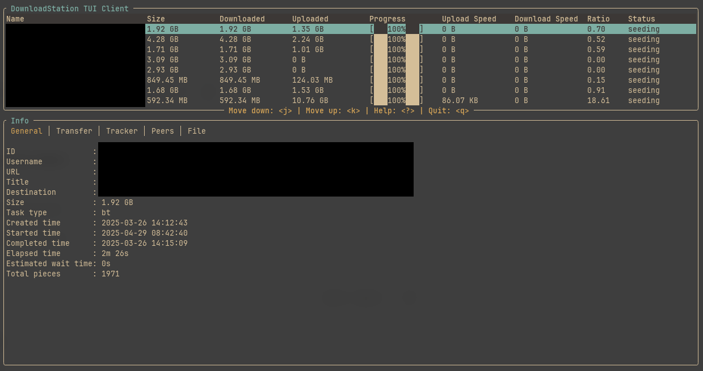
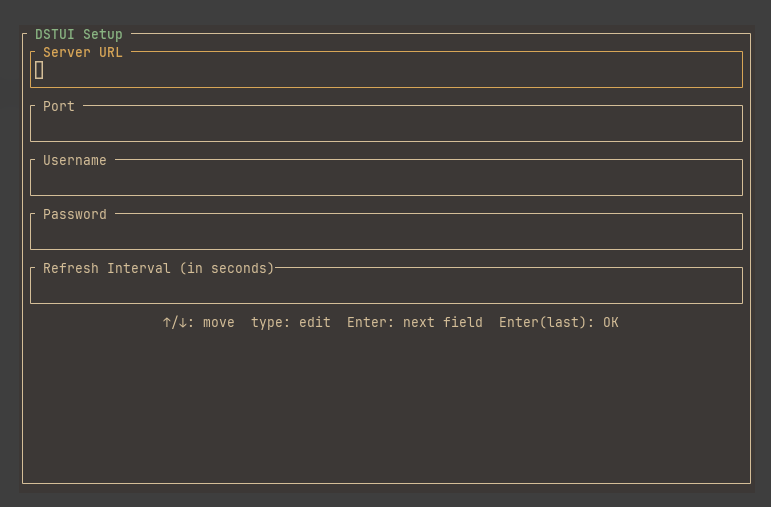

# DSTUI

A terminal-based client for the Synology DownloadStation, using the official (and outdated) Synology API.



## Motivation
I wanted to have a TUI app where I can check the status of my downloads on my Synology NAS.

I'm not a developer by trade so the software is just hacked together based on my very limited Rust knowledge, but hey, it's working!

The client is mainly for personal use, but I thought I'll share it here as well, maybe someone finds it useful. Pull requests and any comments on the code itself are welcome, this was a learning project for me (and still is).

## Installation
You need a working Rust ecosystem. Just install it with [rustup](https://rustup.rs/)

Clone the repository and change to its directory and after that:
```bash
cargo run
```

If you'd like to have a proper executable, which you can place anywhere on your system do a:
```
cargo build --release
```

The resulting executable will be in the `target/release` directory. You only need the `dstui` executable from here. Just put it anywhere you like.

## First run
When you first run `dstui` and it does not detect a config file, a config panel shows, like this:



You can use http or https for the server address, also you can use a host name or an IP address as well.

The https certificate will not be checked `dstui` accepts all certificates without question. This is useful in a home environment where you might be operating with self-signed certs, but you should know about this because it can be a security issue.

## Configuration
The location of the config file is as follows:
  - Mac: `~/Library/Application\ Support/dstui/config.toml`
  - Linux: `~/.config/dstui/config.toml`
  - Windows: can't test this but it *should be* in `{FOLDERID_RoamingAppData}`, like `C:\Users\Alice\AppData\Roaming\dstui\config.toml`

The config file itself can be edited manually. **!Warning!:** the password is stored in clear-text!

## Usage
Just hit `?` and there will be a nice help panel with the shortcuts. I use vim, so the keyboard shortcuts are comfortable for me, but YMMV.

## Colors and design
The color palette looks OK for me, but I use [wezterm](https://wezterm.org/) and a Gruvbox theme, so again YMMV.

# Possible future improvements
- [ ] Adding tasks, right now this is not implemented
- [ ] Scrollable info window (mostly for the files tab)
- [ ] Tests!
- [ ] Hashing the password in the config file, so it's not stored in clear-text
- [ ] Some kind of release? Right now you can compile it for yourself, it should work for every OS. I tested it on Mac and Linux only
- [ ] Using the newer DownloadStation2 API, which has no official documentation, so this is a stretch goal for me

